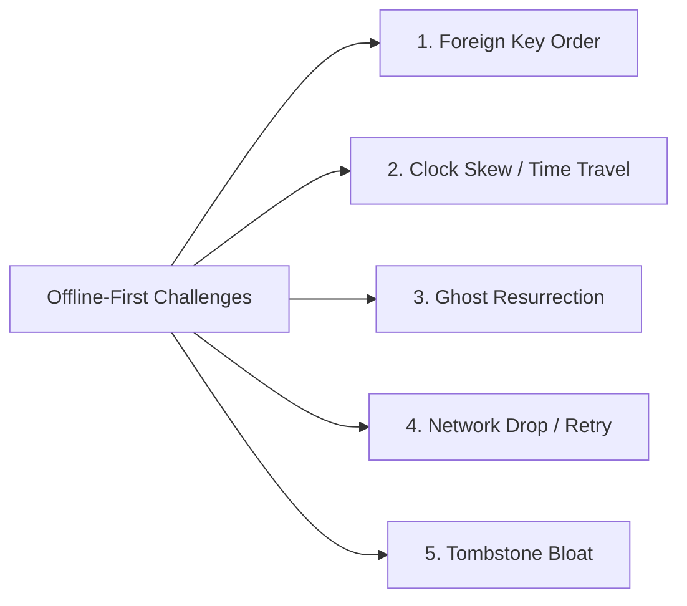
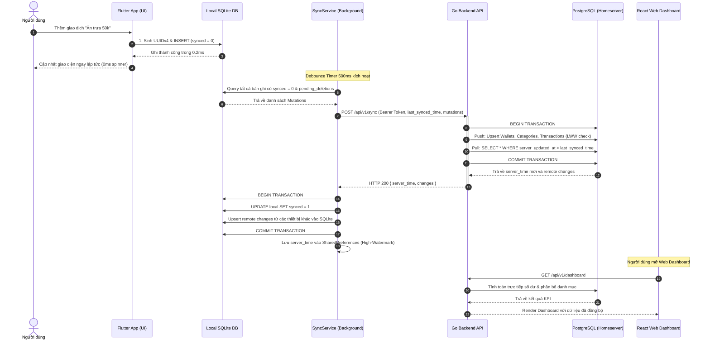

# Kiến Trúc Đồng Bộ Offline-First (Offline-First Sync Engine Architecture)

Tài liệu này ghi chép chi tiết nguyên lý, thiết kế kiến trúc, các trụ cột kỹ thuật và giải pháp xử lý các trường hợp biên (Edge Cases) của hệ thống đồng bộ hai chiều đa thiết bị (**Two-Way Delta Synchronization**) trong hệ sinh thái **Simo** (Flutter Mobile, Go Backend và React Web).

---

## 1. So sánh Tư duy: Online-First vs. Offline-First

| Tiêu chí | Online-First (Mô hình truyền thống) | Offline-First (Mô hình Local-First của Simo) |
| :--- | :--- | :--- |
| **Vị trí Database chính** | Nằm trên Remote Server. Client chỉ là view mượn tạm dữ liệu. | **Nằm ngay trên thiết bị người dùng (SQLite)**. Server chỉ là Hub trung chuyển & sao lưu. |
| **Trải nghiệm thao tác (UX)** | Phụ thuộc độ trễ mạng. Bấm nút $\rightarrow$ quay spinner chờ API (200-500ms) $\rightarrow$ cập nhật UI. | **Phản hồi tức thì 0ms (Zero Latency)**. Ghi trực tiếp vào SQLite local trong 0.2ms rồi cập nhật UI ngay. |
| **Khi mất mạng / Server sập** | Ứng dụng tê liệt, báo lỗi đỏ, người dùng không thể nhập liệu. | **Hoạt động 100% bình thường**. Dữ liệu được xếp hàng chờ (queue) và tự động sync khi có mạng. |
| **Tạo khóa chính (ID)** | Server tự tăng (`SERIAL / AUTO_INCREMENT`). | **Client tự sinh UUIDv4 ngẫu nhiên độc lập**. |
| **Tải lượng Backend** | Rất cao (xử lý hàng triệu request CRUD đọc/ghi vụn vặt). | **Rất nhẹ (chỉ nhận các gói tổng hợp Delta Sync)**; Client tự gánh tải tính toán và truy vấn. |

```mermaid
graph TD
    subgraph "Online-First Architecture"
        Client1[Client App] -->|HTTP Request / Spinner Wait| Server1[Remote Server & DB]
        Server1 -.->|Network Failure / 504 Timeout| Crash[Tê liệt ứng dụng]
    end

    subgraph "Offline-First Architecture (Simo)"
        UI[Mobile / Web UI] <== 0ms ==> LocalDB[(Local SQLite DB)]
        LocalDB <-->|Background Sync Engine| SyncWorker[Sync Service]
        SyncWorker <-->|Push Mutations / Pull Deltas| GoServer[Go Backend Hub]
        GoServer <-->|ACID Persistence| Postgres[(PostgreSQL Server DB)]
    end
```



---

## 2. Năm Trụ Cột Kỹ Thuật Cốt Lõi (Core Pillars)

### Trụ cột 1: Tự sinh ID ở Client (Client-Generated UUIDv4)
- **Vấn đề**: Khi offline, client không thể hỏi server số ID tiếp theo để liên kết quan hệ cha-con (ví dụ: tạo Ví rồi tạo Giao dịch thuộc ví đó).
- **Giải pháp**: 100% Entity (Ví, Giao dịch, Danh mục, Khoản vay...) được client tự sinh **UUIDv4 (128-bit)** ngay khi bấm Lưu. Xác suất va chạm (collision) giữa 2 thiết bị là $1 / 10^{36}$ (gần như bằng 0). Nhờ đó, cây quan hệ dữ liệu được tạo trọn vẹn offline.

### Trụ cột 2: Xóa mềm & Khái niệm "Bia mộ" (Tombstones)
- **Vấn đề**: Nếu chạy `DELETE FROM` vật lý khi offline, bản ghi sẽ biến mất. Khi kết nối lại, server và các máy khác không thể biết bản ghi đó đã bị xóa hay chưa từng tồn tại.
- **Giải pháp**:
  - Không bao giờ DELETE cứng trong quá trình sync.
  - Sử dụng cờ xóa mềm `deleted_at = TIMESTAMP` hoặc ghi vào bảng `pending_deletions (table_name, id, deleted_at)`.
  - Dấu vết này gọi là **Tombstone (Bia mộ)**. Server nhận Tombstone sẽ cập nhật trạng thái xóa trong PostgreSQL và truyền bia mộ đó sang các thiết bị khác để đồng bộ xóa theo.

### Trụ cột 3: Quy trình Push-First, Pull-Second & High-Watermark Cursor
Trong mỗi chu kỳ đồng bộ:
1. **Push trước (Mutations)**: Client gom toàn bộ các dòng có cờ `synced = 0` gửi lên Server.
2. **Server Arbiter**: Server ghi đè dữ liệu mới vào PostgreSQL trong 1 Transaction, đóng dấu thời gian hiện tại của Server (`server_updated_at = NOW() AT TIME ZONE 'UTC'`).
3. **Pull sau (Deltas)**: Server tìm tất cả các bản ghi có `server_updated_at > last_synced_server_time` (mốc con trỏ lần cuối thiết bị này sync) và trả về cho Client.
4. **Cập nhật Cursor**: Client nhận dữ liệu, cập nhật mốc thời gian Server mới nhất vào `SharedPreferences`. Các lần sync tiếp theo chỉ kéo phần chênh lệch (Delta), không bao giờ kéo lại toàn bộ Database.

### Trụ cột 4: Giải quyết xung đột (Conflict Resolution - Last Write Wins)
- Với các trường hợp sửa cùng một bản ghi trên nhiều thiết bị: Áp dụng chiến lược **Last-Write-Wins (LWW) dựa trên `client_updated_at`**. Bản ghi nào có thời điểm thao tác phía người dùng mới hơn sẽ được ưu tiên ghi đè.
- Nếu thời điểm sửa của một máy cũ hơn thời điểm xóa của máy khác $\rightarrow$ Ưu tiên lệnh Xóa, triệt tiêu lệnh sửa cũ.

### Trụ cột 5: Không lưu Dữ liệu Dẫn xuất (Event-Driven / Append-Only Balance)
- **Quy tắc**: Không đồng bộ con số dư tĩnh (ví dụ: `wallet_balance = 10.000.000đ`), vì nếu 2 máy cùng chi tiêu offline thì số dư sẽ bị đè bẹp mất mát.
- **Giải pháp**: Chỉ đồng bộ **giao dịch phát sinh** (`+500k`, `-200k`, `chuyển 100k`). Mỗi client tự tính toán tổng tài sản dựa trên:
  $$\text{Số dư hiện tại} = \text{Số dư ban đầu} + \sum \text{Thu} - \sum \text{Chi} + \sum \text{Chuyển đến} - \sum \text{Chuyển đi}$$

---

## 3. Các Trường Hợp Biên Kinh Điển & Cách Hóa Giải (Edge Cases)



### 1. Lỗi Khóa ngoại & Thứ tự phụ thuộc (Foreign Key Dependency)
- **Hiện tượng**: Máy A tạo Danh mục rồi tạo Giao dịch gán vào danh mục đó. Nếu Server xử lý mảng `transactions` trước `categories` $\rightarrow$ Crash lỗi vi phạm khóa ngoại (FK Violation).
- **Hóa giải**: Thứ tự đồng bộ ở cả Client và Server bắt buộc tuân theo đồ thị phụ thuộc (Topological Order):
  $$\text{Wallets, Categories} \longrightarrow \text{Recurring Configs} \longrightarrow \text{Transactions, Transfers} \longrightarrow \text{Budgets, Saving Goals, Loans}$$

### 2. Lệch đồng hồ Client (Clock Skew / Time Traveler Protection)
- **Hiện tượng**: Máy client bị chỉnh giờ sang năm 2030. Mọi thao tác từ máy này sẽ mang `client_updated_at = 2030`, biến nó thành "vua tuyệt đối" đè bẹp mọi máy khác trong suốt nhiều năm.
- **Hóa giải**:
  - `client_updated_at`: Chỉ dùng để phân xử xung đột giữa 2 bản ghi cùng thời điểm.
  - `server_updated_at`: **Tuyệt đối 100% lấy giờ chuẩn của Server (`NOW() UTC`)**.
  - Server Sanity Check: Nếu `client_updated_at > server_now + 5 phút`, Server tự ép `client_updated_at = server_now`.

### 3. Hiện tượng "Bóng ma phục sinh" (Ghost Resurrection)
Có 2 kịch bản dẫn đến việc bản ghi bị xóa đột ngột sống lại:
- **Kịch bản A (Sửa khi offline đè lên Xóa)**:
  - Tháng 1: Máy A và Máy B cùng có $T_1$.
  - Tháng 2: Máy A offline, sửa ghi chú $T_1$ (`synced = 0`, `client_updated_at = 01/02`). Máy A tắt nguồn.
  - Tháng 3: Máy B online, bấm Xóa $T_1$ $\rightarrow$ Server ghi nhận `deleted_at = 10/03`.
  - Tháng 8: Máy A online, Push $T_1$ lên.
  - *Hóa giải*: Câu lệnh SQL Upsert trên Server kiểm tra:
    ```sql
    INSERT INTO transactions (...) VALUES (...)
    ON CONFLICT (id) DO UPDATE SET
        note = EXCLUDED.note,
        amount = EXCLUDED.amount,
        server_updated_at = NOW()
    WHERE transactions.deleted_at IS NULL 
       OR EXCLUDED.client_updated_at > transactions.deleted_at;
    ```
    Thời điểm sửa (`01/02`) cũ hơn thời điểm xóa (`10/03`) $\rightarrow$ Bỏ qua, giữ nguyên trạng thái đã xóa.
- **Kịch bản B (Xóa cứng làm mất trí nhớ của Server)**:
  - Nếu Server dùng `DELETE FROM` vật lý ở Tháng 3, Server sẽ quên hoàn toàn $T_1$. Khi Máy A push $T_1$ vào Tháng 8, Server tưởng là bản ghi mới và `INSERT` mới $\rightarrow$ Hồi sinh.
  - *Hóa giải*: **Bắt buộc lưu Tombstone** trên Server tối thiểu 30–90 ngày.

### 4. Rớt mạng giữa chừng & Tính bất biến (Network Drop & Idempotency)
- **Hiện tượng**: Server ghi DB thành công 100%, nhưng trên đường trả HTTP 200 về thì rớt mạng. Client tưởng lỗi nên gửi lại gói sync lần 2.
- **Hóa giải**: Tất cả thao tác ghi trên Server đều dùng `INSERT ... ON CONFLICT (id) DO UPDATE`. Gửi lại 1 lần hay 1000 lần thì dữ liệu trong PostgreSQL vẫn đồng nhất, không bao giờ sinh bản ghi trùng lặp.

### 5. Dọn dẹp rác bộ nhớ (Tombstone TTL & Garbage Collection)
- **Hiện tượng**: Giữ bia mộ mãi mãi sẽ làm phình to DB sau nhiều năm.
- **Hóa giải**: Thiết lập TTL cho Tombstone (ví dụ 90 ngày). Sau 90 ngày, một tiến trình Cron định kỳ sẽ dọn dẹp vật lý các bản ghi `deleted_at < NOW() - INTERVAL '90 days'`.

---

## 4. Sơ đồ Tuần tự Chi tiết (End-to-End Sequence Diagram)



---

## 5. Kiến Trúc Xác Thực Google & Phân Quyền Đa Người Dùng (Multi-Tenant Google OAuth)

### 5.1. Luồng Xác Thực Google OAuth 2.0 / OIDC
1. **Mobile (Flutter)**: Sử dụng SDK `google_sign_in` gọi native Google account picker để lấy cryptographic `id_token`.
2. **Web (React 19)**: Sử dụng Google Identity Services (GIS) / `@react-oauth/google` popup để nhận credential `id_token`.
3. **Backend Exchange**: Client gửi `POST /api/v1/auth/google` với `id_token`. Go backend xác thực chữ ký số qua endpoint Google TokenInfo/JWKS, trích xuất `sub`, `email`, `name`, `picture` và thực hiện `UPSERT` vào bảng `users` trong PostgreSQL.
4. **Session Token**: Backend cấp Simo JWT Token (HMAC-SHA256, hạn 30 ngày) chứa claim `user_id` (UUID). Client lưu vào Secure Storage / `localStorage` và tự động gắn vào header `Authorization: Bearer <token>` trong mọi request đồng bộ.

### 5.2. Nguyên Tắc Cách Ly Dữ Liệu Đa Người Dùng (Multi-Tenant Isolation)
- **100% Query Phân quyền theo `user_id`**: Mọi bảng dữ liệu tài chính (`wallets`, `categories`, `transactions`, `monthly_budgets`, `saving_goals`, `loan_contacts`) đều có cột `user_id UUID NOT NULL REFERENCES users(id)`.
- **Zero Cross-Leak**: Backend middleware giải mã JWT token, ép kiểu UUID và nhét vào Request Context. Toàn bộ câu lệnh SQL từ `SyncService`, `DashboardService`, `WalletRepo` đến `TransactionRepo` đều bắt buộc chứa mệnh đề `WHERE user_id = $authenticated_user_id`.

### 5.3. Trải Nghiệm Khởi Động Ngoại Tuyến (Offline-First Continuity)
- Người dùng đã đăng nhập khi bật chế độ máy bay vẫn khởi động app tức thì (0ms) nhờ token và profile lưu trong cache local (`SharedPreferences`).
- Mọi giao dịch được ghi trong lúc offline được gắn với user session hiện tại và sẽ tự động đồng bộ lên cloud ngay khi thiết bị có kết nối Internet trở lại.
