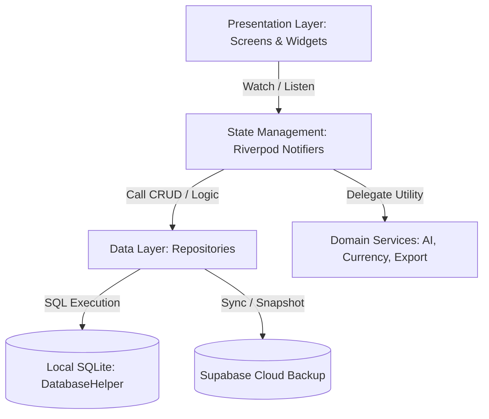
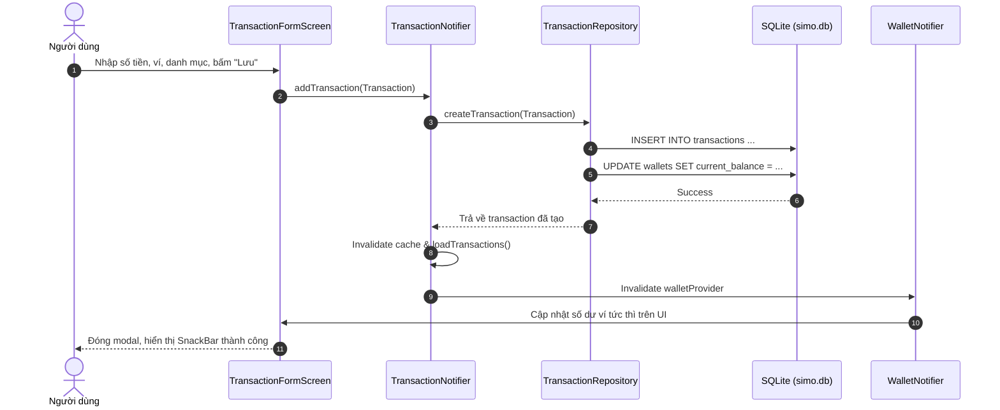

# Kiến Trúc Tổng Quan (System Overview & Architecture)

**Simo** là ứng dụng quản lý tài chính cá nhân đa nền tảng (ưu tiên Android/iOS) được thiết kế theo triết lý **Offline-First & Privacy-First**. Người dùng có toàn quyền kiểm soát dữ liệu tài chính của mình trên thiết bị local, đồng thời hỗ trợ sao lưu đám mây (Cloud Backup) an toàn thông qua Supabase.

---

## 1. Triết lý Thiết kế Cốt lõi (Core Principles)

1. **Offline-First Tuyệt Đối**: Mọi thao tác ghi chép (thêm giao dịch, tạo ví, đặt hạn mức, trả nợ) đều được lưu trữ trực tiếp vào cơ sở dữ liệu **SQLite** cục bộ trên máy, đảm bảo tốc độ phản hồi tức thì (<16ms) và khả năng hoạt động 100% không cần kết nối mạng.
2. **Quyền Riêng Tư (Privacy-First)**: Không thu thập dữ liệu nhạy cảm của người dùng. Không bắt buộc đăng nhập để sử dụng các tính năng quản lý tài chính cốt lõi.
3. **Độ Tin Cậy Dữ Liệu (ACID & Transaction Safety)**: Các thao tác liên quan đến biến động tài chính phức tạp (chuyển tiền giữa 2 ví, nạp tiền vào mục tiêu tiết kiệm, thanh toán nợ) luôn được thực thi trong một `db.transaction()` đơn nguyên (Atomic) để loại trừ rủi ro sai lệch số dư.
4. **Nhập Liệu Nhanh & Tự Động Hóa (AI & Speech Powered)**: Hỗ trợ chuyển đổi giọng nói thành văn bản (Speech-to-Text) và phân tích ngôn ngữ tự nhiên bằng LLM (OpenAI / Edge AI) để tự động bóc tách số tiền, danh mục và ngày tháng từ một câu nói duy nhất.

---

## 2. Tech Stack Chiến Lược

| Thành phần | Công nghệ / Thư viện | Vai trò |
| :--- | :--- | :--- |
| **Framework** | [Flutter](https://flutter.dev) (Dart SDK `^3.10.1`) | UI Toolkit đa nền tảng hiện đại |
| **State Management** | [flutter_riverpod](https://pub.dev/packages/flutter_riverpod) `^2.6.1` | Quản lý state reactive, compile-time safe, DI qua Provider |
| **Local Storage** | [sqflite](https://pub.dev/packages/sqflite) + [sqflite_common_ffi](https://pub.dev/packages/sqflite_common_ffi) | SQLite engine cục bộ (Mobile & Test suite trên Linux) |
| **Key-Value Store** | [shared_preferences](https://pub.dev/packages/shared_preferences) `^2.3.3` | Lưu cấu hình người dùng, flag theme, active wallet ID |
| **AI & Voice** | [speech_to_text](https://pub.dev/packages/speech_to_text) + [dart_openai](https://pub.dev/packages/dart_openai) | Nhận diện giọng nói và bóc tách thực thể giao dịch bằng AI |
| **Data Visualization** | [fl_chart](https://pub.dev/packages/fl_chart) `^0.69.2` | Biểu đồ tròn (PieChart) & cột phân tích dòng tiền |
| **Export & Reporting** | [excel](https://pub.dev/packages/excel), [csv](https://pub.dev/packages/csv), [pdf](https://pub.dev/packages/pdf), [printing](https://pub.dev/packages/printing) | Xuất báo cáo tài chính sao kê đa định dạng |
| **Backend / Cloud** | [Supabase](https://supabase.com) (PostgreSQL + Edge Functions) | Sao lưu đám mây snapshot JSON & đồng bộ đa thiết bị |
| **Monetization** | [google_mobile_ads](https://pub.dev/packages/google_mobile_ads) `^5.1.0` | Quảng cáo banner & video thưởng 12h ad-free (tùy chọn compile) |

---

## 3. Kiến Trúc Phân Tầng (Layered Architecture)

Simo áp dụng mô hình kiến trúc phân tầng thực dụng (**Pragmatic Layered Architecture**), đảm bảo nguyên tắc phân tách trách nhiệm (Separation of Concerns) và dễ dàng kiểm thử (Testability):

### Chi tiết các tầng:
1. **Presentation Layer (`lib/screens`, `lib/widgets`)**:
   - Chịu trách nhiệm render giao diện người dùng dựa trên state từ Riverpod.
   - Không chứa câu truy vấn database hoặc logic tính toán tiền tệ phức tạp.
   - Nhận diện các tương tác người dùng và gọi các phương thức tương ứng trên Provider Notifier.
2. **State Management Layer (`lib/providers`)**:
   - Sử dụng `Notifier` và `AsyncNotifier` của Riverpod 2.x để quản lý vòng đời dữ liệu.
   - Xử lý các trạng thái `AsyncLoading`, `AsyncData`, `AsyncError`.
   - Quản lý invalidation giữa các provider phụ thuộc (ví dụ: khi thêm giao dịch mới -> invalidate cả `walletProvider`, `transactionProvider` và `monthlyBudgetFamily`).
3. **Repository Layer (`lib/repositories`)**:
   - Trừu tượng hóa việc truy xuất dữ liệu từ cơ sở dữ liệu SQLite thông qua `DatabaseHelper`.
   - Thực thi các câu lệnh SQL an toàn, mapping giữa bảng cơ sở dữ liệu và Dart Model.
4. **Service Layer (`lib/services`)**:
   - Chứa các business logic độc lập hoặc tương tác với third-party APIs: `AiTransactionService`, `CurrencyService`, `BackupService`, `ExportService`, `FuzzySearchService`.
5. **Data Storage Layer (`lib/models`, `lib/repositories/database_helper.dart`)**:
   - Định nghĩa các entity thuần túy (immutable structs).
   - Quản lý vòng đời kết nối SQLite, schema migration từ v1 lên v16, và đảm bảo toàn vẹn dữ liệu.

---

## 4. Luồng Dữ Liệu Chuẩn (Standard Data Flow)

Dưới đây là chu trình xử lý dữ liệu khi người dùng tạo một giao dịch mới:

