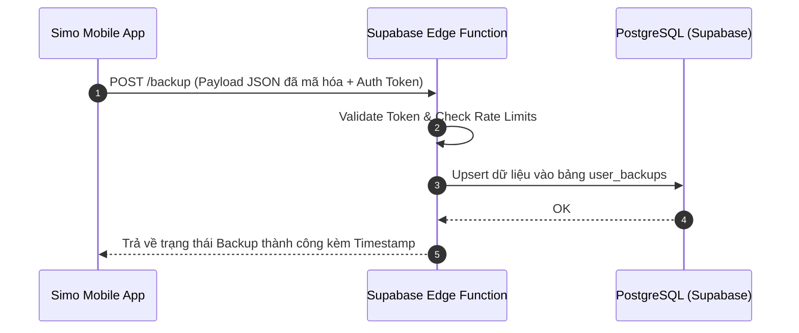

# Đồng Bộ Đám Mây & Sao Lưu Dữ Liệu (Cloud Sync & Backup Snapshot)

Simo cung cấp hai cơ chế bảo toàn dữ liệu tài chính:
1. **Local Snapshot JSON**: Xuất/nhập file sao lưu độc lập (có thể chia sẻ qua Drive, Zalo, Email).
2. **Cloud Backup (Supabase)**: Đồng bộ mã hóa lên backend Supabase thông qua PostgreSQL và Edge Functions.

---

## 1. Cấu Trúc Bản Sao Lưu Cục Bộ (Snapshot JSON)

Khi người dùng thực hiện sao lưu thủ công, `BackupService` sẽ trích xuất toàn bộ dữ liệu SQLite thành một tệp JSON có cấu trúc chuẩn hóa (`BackupSnapshot`):

```json
{
  "version": "1.3.0",
  "exported_at": "2026-09-12T06:50:00.000Z",
  "device_id": "8f3b...-unique-uuid",
  "checksum": "sha256_hash_string",
  "data": {
    "wallets": [...],
    "wallet_transfers": [...],
    "categories": [...],
    "transactions": [...],
    "monthly_budgets": [...],
    "category_monthly_budgets": [...],
    "saving_goals": [...],
    "saving_goal_logs": [...],
    "loan_contacts": [...],
    "loan_transactions": [...],
    "settings": {...}
  }
}
```

### Quy Trình Kiểm Tra Tính Toàn Vẹn Khi Nhập Dữ Liệu (Import Inspection)
Trước khi ghi đè hoặc hợp nhất dữ liệu từ file backup, lớp `ImportInspection` sẽ thực hiện:
1. **Kiểm tra phiên bản**: Đảm bảo phiên bản tệp backup không cao hơn phiên bản hiện tại của app.
2. **Xác thực Checksum**: Kiểm tra tính nguyên vẹn của chuỗi SHA256 nhằm ngăn chặn tệp bị hỏng hoặc chỉnh sửa sai cú pháp.
3. **Thống kê trước khi nhập**: Hiển thị cho người dùng biết file chứa bao nhiêu ví, giao dịch, danh mục trước khi bấm xác nhận.

---

## 2. Kiến Trúc Đồng Bộ Supabase Cloud

Khi người dùng kích hoạt tính năng Sao lưu Đám mây:



### 2.1. Lược Đồ Bảng Trên Supabase (`supabase_schema.sql`)
- `profiles`: Lưu thông tin tài khoản người dùng (`id`, `email`, `created_at`).
- `user_backups`: Lưu bản snapshot JSON mới nhất của từng người dùng (`user_id`, `snapshot_data`, `updated_at`).
- **Row Level Security (RLS)**: Bật 100% RLS trên tất cả các bảng, đảm bảo người dùng chỉ có thể đọc/ghi dữ liệu của chính họ (`auth.uid() = user_id`).
