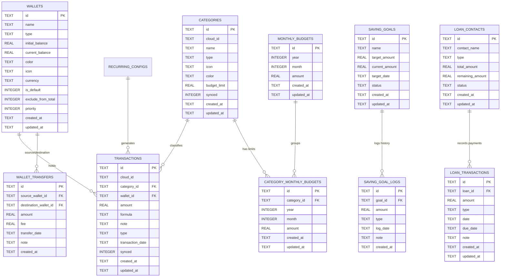

# Lược Đồ Cơ Sở Dữ Liệu (SQLite Database Schema)

Hệ thống lưu trữ cục bộ của Simo được quản lý bởi tệp cơ sở dữ liệu SQLite duy nhất: `simo.db` với phiên bản hiện tại là **Version 16**.

---

## 1. Sơ Đồ Quan Hệ Thực Thể (ERD)

---

## 2. Chi Tiết Các Bảng Dữ Liệu

### 2.1. Bảng `wallets` (Quản lý ví)
- `id` (TEXT PK): Mã định danh duy nhất (UUID v4 hoặc `'default_cash_wallet'`).
- `name` (TEXT NOT NULL): Tên ví (ví dụ: Tiền mặt, Techcombank, MoMo).
- `type` (TEXT NOT NULL): Loại ví (`cash`, `bank`, `e_wallet`, `credit`).
- `initial_balance` (REAL NOT NULL DEFAULT 0.0): Số dư ban đầu khi tạo ví.
- `current_balance` (REAL NOT NULL DEFAULT 0.0): Số dư hiện tại sau khi cộng trừ thu/chi và chuyển tiền.
- `color` (TEXT NOT NULL): Mã màu Hex (ví dụ: `#10B981`).
- `icon` (TEXT NOT NULL): Tên icon Material.
- `currency` (TEXT): Đơn vị tiền tệ riêng của ví (`VND`, `USD`...). Nếu null thì theo mặc định của app.
- `is_default` (INTEGER NOT NULL DEFAULT 0): 1 nếu là ví mặc định khi tạo giao dịch mới.
- `exclude_from_total` (INTEGER NOT NULL DEFAULT 0): 1 nếu muốn loại trừ số dư ví này khỏi Tổng tài sản.
- `priority` (INTEGER NOT NULL DEFAULT 0): Điểm ưu tiên sắp xếp (số lớn hơn hiển thị trước trên thanh chọn ngang).

### 2.2. Bảng `wallet_transfers` (Lịch sử chuyển tiền nội bộ)
- `id` (TEXT PK): UUID giao dịch chuyển tiền.
- `source_wallet_id` (TEXT NOT NULL FK -> `wallets.id` ON DELETE CASCADE).
- `destination_wallet_id` (TEXT NOT NULL FK -> `wallets.id` ON DELETE CASCADE).
- `amount` (REAL NOT NULL): Số tiền chuyển từ ví nguồn sang ví đích.
- `fee` (REAL NOT NULL DEFAULT 0.0): Phí chuyển tiền (nếu có, trừ thêm vào ví nguồn).
- `transfer_date` (TEXT NOT NULL): Ngày chuyển định dạng ISO 8601.
- `note` (TEXT): Ghi chú chuyển khoản.

### 2.3. Bảng `categories` (Danh mục)
- `id` (TEXT PK): UUID hoặc mã danh mục hệ thống (`sys_food`, `sys_salary`...).
- `name` (TEXT NOT NULL): Tên hiển thị của danh mục.
- `type` (TEXT NOT NULL): Loại danh mục (`expense` hoặc `income`).
- `icon` (TEXT): Tên icon tương ứng.
- `color` (TEXT): Mã màu Hex.
- `budget_limit` (REAL): Hạn mức chi tiêu mặc định của danh mục cho các tháng.

### 2.4. Bảng `transactions` (Giao dịch thu / chi)
- `id` (TEXT PK): UUID giao dịch.
- `category_id` (TEXT FK -> `categories.id`): Danh mục giao dịch. Cho phép `NULL` nếu danh mục bị xóa.
- `wallet_id` (TEXT FK -> `wallets.id`): Ví phát sinh dòng tiền.
- `amount` (REAL NOT NULL): Giá trị giao dịch (luôn là số dương).
- `formula` (TEXT): Biểu thức tính nhẩm nếu có (ví dụ: `50000+25000`).
- `note` (TEXT): Ghi chú chi tiết.
- `type` (TEXT NOT NULL): `expense` (chi) hoặc `income` (thu).
- `transaction_date` (TEXT NOT NULL): Ngày giao dịch (dùng cho thống kê và bộ lọc).

### 2.5. Bảng `monthly_budgets` & `category_monthly_budgets`
- `monthly_budgets`:
  - `year` (INTEGER), `month` (INTEGER), `amount` (REAL): Ngân sách tổng chi tiêu của toàn bộ tháng.
  - Chỉ mục duy nhất: `idx_monthly_budgets_ym ON monthly_budgets(year, month)`.
- `category_monthly_budgets`:
  - `category_id` (TEXT FK -> `categories.id`), `year` (INTEGER), `month` (INTEGER), `amount` (REAL): Hạn mức đặt riêng cho một danh mục trong tháng cụ thể.
  - Chỉ mục duy nhất: `idx_cat_monthly_budgets_cym ON category_monthly_budgets(category_id, year, month)`.

### 2.6. Bảng `saving_goals` & `saving_goal_logs`
- `saving_goals`: Quản lý heo đất/quỹ tiết kiệm (`target_amount`, `current_amount`, `status`: `active`, `completed`).
- `saving_goal_logs`: Ghi nhận từng lần nạp (`deposit`) hoặc rút (`withdraw`).

### 2.7. Bảng `loan_contacts` & `loan_transactions`
- `loan_contacts`: Quản lý các khoản nợ (`type`: `lend` - cho vay, `borrow` - đi vay; `total_amount`, `remaining_amount`, `status`: `active`, `completed`).
- `loan_transactions`: Lịch sử các đợt trả nợ từng phần.

---

## 3. Lịch Sử Di Cư (Migration History v1 -> v16)

Hệ thống quản lý version database chặt chẽ trong `DatabaseHelper._upgradeDB`:

| Version | Thay đổi chính |
| :---: | :--- |
| **v3** | Chuyển đổi cờ `is_system` thành cột `type` (`expense`/`income`) cho `categories`. |
| **v4** | Bổ sung cột `icon` và `color` cho bảng `categories`. |
| **v5** | Thêm cột `cloud_id` và cờ `synced`, tạo bảng `pending_deletions` chuẩn bị sync. |
| **v6** | Dọn dẹp danh mục mặc định cũ (prefix `cat_`) sang chuẩn mới. |
| **v7** | Tạo 2 bảng quản lý sổ nợ: `loan_contacts` và `loan_transactions`. |
| **v8 - v9** | Thêm `due_date` và chuẩn hóa bảng nợ sang `loan_contacts`. |
| **v10** | Thêm cột `budget_limit` vào bảng `categories`. |
| **v11** | Bổ sung cột `transaction_date` vào `transactions`. |
| **v12** | Tạo 2 bảng ngân sách: `monthly_budgets` và `category_monthly_budgets` kèm Unique Index. |
| **v13** | Tạo 2 bảng mục tiêu tiết kiệm: `saving_goals` và `saving_goal_logs`. |
| **v14** | **Bước ngoặt Đa Ví**: Thêm bảng `wallets` và `wallet_transfers`; thêm `wallet_id` vào `transactions`; tự động tạo Ví Tiền Mặt mặc định và liên kết toàn bộ giao dịch cũ. |
| **v15** | Thêm `wallet_id` vào `recurring_configs` (giao dịch định kỳ theo ví). |
| **v16** | Bổ sung cột `priority` (độ ưu tiên sắp xếp ví trên thanh cuộn ngang) vào bảng `wallets`. |
