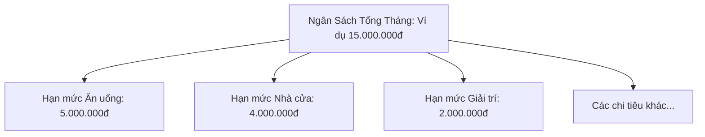

# Ngân Sách Hàng Tháng & Hạn Mức Danh Mục (Monthly Budgets & Category Limits)

Màn hình **"Danh mục & Hạn mức"** (`CategoryBudgetScreen`) cung cấp công cụ lập kế hoạch tài chính và kiểm soát chi tiêu theo từng chu kỳ tháng.

---

## 1. Cơ Chế Hai Tầng Ngân Sách (Two-tier Budget System)

1. **Ngân Sách Tổng (`monthly_budgets`)**:
   - Số tiền trần người dùng dự định chi tiêu trong cả tháng.
   - So sánh trực tiếp với $\sum \text{Expenses trong tháng}$ để tính phần trăm đã dùng và số tiền còn lại.
2. **Hạn Mức Từng Danh Mục (`category_monthly_budgets`)**:
   - Hạn mức riêng cho từng mục chi tiêu (chỉ áp dụng cho category có `type == 'expense'`).
   - Hiển thị thanh tiến độ màu sắc (Xanh: an toàn, Vàng: cảnh báo trên 80%, Đỏ: vượt hạn mức).

---

## 2. Quy Tắc Kế Thừa Hạn Mức (Rollover & Isolation Rules)

Một trong những tính năng thông minh của Simo là xử lý sự khác biệt giữa **Danh mục (toàn cục)** và **Ngân sách (theo tháng)**:

### 2.1. Chỉnh Sửa Tháng Hiện Tại Hoặc Tương Lai (`!isPastMonth`)
- **Hành vi**:
  - Ghi nhận hạn mức vào bảng `category_monthly_budgets` của tháng đó.
  - Đồng thời cập nhật trường `budget_limit` trong bảng `categories`.
- **Hệ quả**: Hạn mức này sẽ tự động được áp dụng cho tháng hiện tại **và tự động kế thừa sang tất cả các tháng sau** nếu các tháng đó chưa có hạn mức tùy chỉnh riêng.
- **Ghi chú trên UI**: *"Áp dụng cho tháng MM/yyyy và các tháng tiếp theo"*.

### 2.2. Chỉnh Sửa Tháng Trong Quá Khứ (`isPastMonth`)
- **Hành vi**:
  - Chỉ ghi nhận vào bảng `category_monthly_budgets` của tháng quá khứ đó.
  - **Không ghi đè** trường `budget_limit` của bảng `categories`.
- **Hệ quả**: Dữ liệu lịch sử của tháng quá khứ được điều chỉnh chính xác mà không làm xáo trộn hạn mức của tháng hiện tại và tương lai.
- **Ghi chú trên UI**: *"Chỉ áp dụng cho tháng MM/yyyy"*.

---

## 3. Trải Nghiệm Người Dùng (UI/UX Standards)

- **Thao tác 1 Chạm**: Chạm vào bất kỳ danh mục nào trong danh sách sẽ mở thẳng modal chỉnh sửa (`CategoryFormModal`), không dùng menu trung gian.
- **Sticky Bottom Action Bar**: Cụm 2 nút cố định ở đáy modal:
  - **Nút Xóa** (Flex 1): Dạng viền đỏ `OutlinedButton`, cảnh báo chuyển các giao dịch liên quan về "Không có danh mục".
  - **Nút Lưu** (Flex 2): Nút nổi màu đen `AppColors.primary` (Slate 900) ở Light theme và Trắng ở Dark theme, đồng bộ với tab Giao dịch. Nút chỉ sáng khi form có thay đổi (`_isDirty`).
- **Tự động đẩy theo bàn phím**: Modal bọc `padding: EdgeInsets.only(bottom: MediaQuery.of(context).viewInsets.bottom)` giúp thanh nút không bị bàn phím che khuất.
