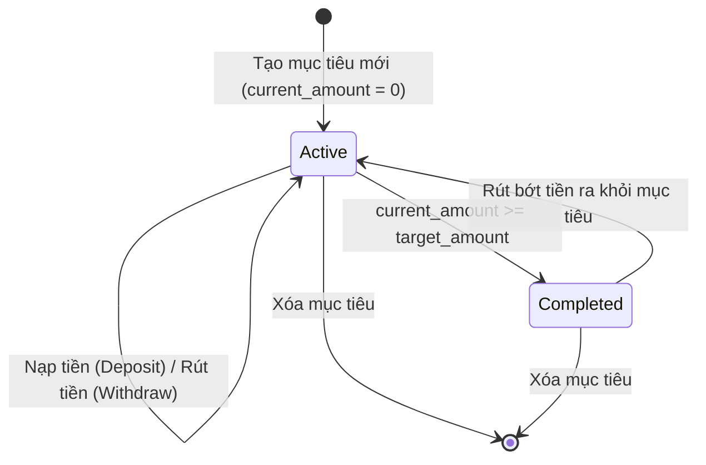

# Mục Tiêu Tiết Kiệm (Savings Goals)

Tính năng **Mục Tiêu Tiết Kiệm** (`SavingGoalsScreen`) giúp người dùng tích lũy tài chính cho các mục đích cụ thể (mua xe, đi du lịch, quỹ dự phòng khẩn cấp, mua sắm thiết bị).

---

## 1. Vòng Đời Của Mục Tiêu (Goal Lifecycle)

1. **Khởi tạo**:
   - Người dùng đặt tên mục tiêu, số tiền cần đạt (`target_amount`), ngày dự kiến hoàn thành (`target_date`), icon và màu đại diện.
   - Trạng thái ban đầu là `active`.
2. **Nạp / Rút tiền**:
   - Mỗi lần nạp tiền (`deposit`) hoặc rút bớt tiền (`withdraw`), một bản ghi được tạo trong bảng `saving_goal_logs` kèm ngày tháng và ghi chú.
   - Cột `current_amount` trong bảng `saving_goals` được cập nhật tương ứng.
3. **Hoàn thành**:
   - Khi `current_amount >= target_amount`, trạng thái tự động chuyển thành `completed` và hiển thị hiệu ứng chúc mừng trên giao diện.

---

## 2. Liên Kết Dòng Tiền Với Ví

- Người dùng có thể lựa chọn trích tiền từ một ví cụ thể khi nạp vào mục tiêu tiết kiệm.
- Lịch sử nạp/rút được hiển thị trực quan trong màn hình chi tiết mục tiêu `SavingGoalDetailScreen`.
