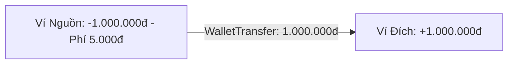

# Tính Năng Ví & Chuyển Tiền Nội Bộ (Wallets & Internal Transfers)

Hệ thống Đa Ví (Multi-Wallet) là một trong những cột trụ cốt lõi của Simo, cho phép người dùng phân bổ dòng tiền thành các tài khoản riêng biệt (tiền mặt, ngân hàng, ví điện tử, thẻ tín dụng).

---

## 1. Cấu Trúc Ví & Điểm Ưu Tiên (Priority)

Mỗi ví sở hữu các thuộc tính sau:
- **`initial_balance`**: Số dư ban đầu tại thời điểm tạo ví.
- **`current_balance`**: Số dư khả dụng hiện thời, được cập nhật theo công thức:
  $$\text{current\_balance} = \text{initial\_balance} + \sum \text{Income} - \sum \text{Expense} + \sum \text{Transfers In} - \sum \text{Transfers Out} - \sum \text{Fees}$$
- **`priority` (Integer)**: Độ ưu tiên hiển thị trên thanh chọn nhanh (`WalletChipSelector`). Ví có điểm ưu tiên cao hơn sẽ luôn đứng trước (sắp xếp `priority DESC, is_default DESC, created_at ASC`).
- **`exclude_from_total` (Boolean)**: Cho phép ẩn số dư ví này khỏi thẻ "Tổng tài sản" (thích hợp cho các quỹ đen hoặc thẻ tín dụng ghi nợ).

---

## 2. Chuyển Tiền Nội Bộ (Internal Transfers)

Khi người dùng rút tiền từ tài khoản ngân hàng về ví tiền mặt, hoặc chuyển khoản giữa 2 ngân hàng:
- Simo ghi nhận giao dịch vào bảng riêng `wallet_transfers`.
- **Tuyệt đối không sinh ra bản ghi trong bảng `transactions`**. Điều này giúp báo cáo thu chi hàng tháng không bị sai lệch (tránh tình trạng tính chuyển tiền vào tổng thu hoặc tổng chi tiêu).
- Hỗ trợ ghi nhận **Phí chuyển tiền (`fee`)**: Phí này được trừ thẳng vào số dư của ví nguồn.



---

## 3. Đồng Bộ & Tính Lại Số Dư (Recalculation)

Trong trường hợp có bất kỳ sự sai lệch nào hoặc khi khôi phục dữ liệu từ bản sao lưu, phương thức `WalletRepository.recalculateWalletBalance(walletId)` sẽ tính toán lại số dư thực tế từ toàn bộ lịch sử giao dịch và chuyển tiền để cập nhật vào cột `current_balance`:

```sql
SELECT 
  w.initial_balance +
  COALESCE((SELECT SUM(amount) FROM transactions WHERE wallet_id = ? AND type = 'income'), 0) -
  COALESCE((SELECT SUM(amount) FROM transactions WHERE wallet_id = ? AND type = 'expense'), 0) +
  COALESCE((SELECT SUM(amount) FROM wallet_transfers WHERE destination_wallet_id = ?), 0) -
  COALESCE((SELECT SUM(amount + fee) FROM wallet_transfers WHERE source_wallet_id = ?), 0)
AS real_balance;
```
