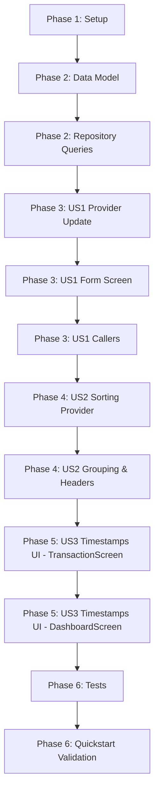

# Tasks: Fix Transaction Date Handling and Timestamps

**Feature**: [Fix Transaction Date Handling and Timestamps](spec.md)
**Plan**: [Implementation Plan](plan.md)
**Status**: Completed

---

## Phase 1: Setup

**Purpose**: Verify database schema and migration prerequisites

- [X] T001 Verify database schema and column definitions for transaction_date and updated_at in lib/repositories/database_helper.dart

---

## Phase 2: Foundational (Data Model & Repository Layer)

**Purpose**: Core data layer foundation that all user stories depend on

- [X] T002 Update Transaction.fromMap and Transaction.toMap in lib/models/transaction.dart with robust null-safe fallback for transaction_date and updated_at
- [X] T003 Update TransactionRepository queries and methods in lib/repositories/transaction_repository.dart to sort by COALESCE(transaction_date, created_at) DESC, created_at DESC and ensure updated_at is set on updates

---

## Phase 3: User Story 1 - Preserve Transaction Date on Edit (Priority: P1) 🎯 MVP

**Goal**: Preserve existing transaction date when editing transactions, fallback to createdAt for legacy data, and allow explicit date updates without defaulting to today's date.

**Independent Test**: Open an existing transaction from a past month in the edit screen; verify that the date selector shows the original date, and saving with updated notes/amount retains the transaction in its original month.

- [X] T004 [US1] Update TransactionNotifier.updateTransaction in lib/providers/transaction_provider.dart to accept and preserve transactionDate and refresh updatedAt
- [X] T005 [US1] Update TransactionFormScreen constructor and _TransactionFormScreenState.initState in lib/screens/transaction_form_screen.dart to accept editTransactionDate / editCreatedAt and pre-populate TransactionItem.transactionDate
- [X] T006 [US1] Update callers navigating to TransactionFormScreen in lib/screens/transaction_screen.dart and lib/screens/dashboard_screen.dart to pass transactionDate and createdAt

---

## Phase 4: User Story 2 - Transaction Sorting by Transaction Date (Priority: P1)

**Goal**: Ensure all transaction listings, summaries, and monthly groups sort chronologically by transactionDate descending.

**Independent Test**: Create or update a transaction with a backdated transactionDate and verify it immediately displays under its respective month and sorted position.

- [X] T007 [US2] Ensure transactionProvider state ordering and list filtering in lib/providers/transaction_provider.dart consistently sort by transactionDate descending
- [X] T008 [US2] Verify month headers and date grouping in lib/screens/transaction_screen.dart and lib/screens/dashboard_screen.dart use transactionDate

---

## Phase 5: User Story 3 - View Detailed 3-Tier Timestamps (Priority: P2)

**Goal**: Display all 3 timestamps (Ngày giao dịch, Ngày tạo, Ngày cập nhật) in exact sequence on the transaction action / detail bottom sheet.

**Independent Test**: Tap any transaction to open the action/details sheet and verify that Ngày giao dịch, Ngày tạo, and Ngày cập nhật are formatted and displayed in that exact order.

- [X] T009 [US3] Add 3-tier timestamp display header (Ngày giao dịch, Ngày tạo, Ngày cập nhật) in _showActionMenu in lib/screens/transaction_screen.dart
- [X] T010 [US3] Add 3-tier timestamp display header in transaction action sheet in lib/screens/dashboard_screen.dart

---

## Phase 6: Polish & Verification

**Purpose**: End-to-end testing and validation

- [X] T011 [P] Run unit tests for transaction model and provider date handling in test/
- [X] T012 Run full quickstart validation scenarios defined in specs/001-fix-transaction-dates/quickstart.md

---

## Dependencies & Execution Order

---

## Implementation Strategy

### MVP Scope (User Story 1)
- Complete Phase 1 (Setup) + Phase 2 (Foundational) + Phase 3 (User Story 1).
- This immediately fixes the data corruption bug when updating past transactions.

### Incremental Delivery
1. **MVP**: Fix transaction date loss on edit (`T001` - `T006`).
2. **Increment 2**: Ensure 100% sorting consistency by transaction date across all views (`T007` - `T008`).
3. **Increment 3**: 3-tier timestamp display on transaction detail modals (`T009` - `T010`).
4. **Final**: Verification & test suite (`T011` - `T012`).
