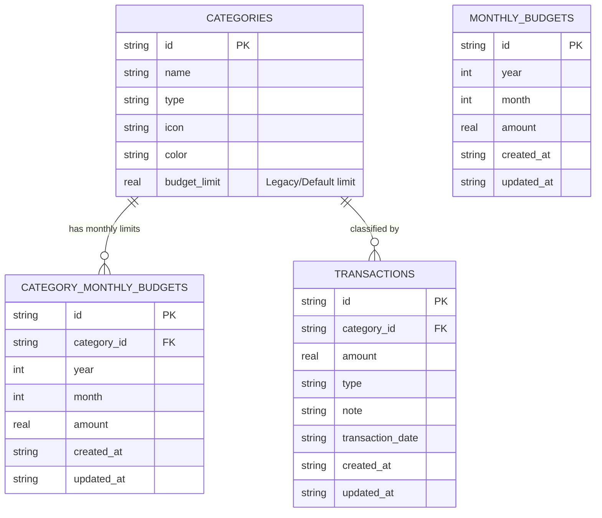

# Data Model: Multi-Month Budget Management & Rich Mock Data

**Feature**: [Multi-Month Budget Management & Rich Mock Data](spec.md)  
**Date**: 2026-08-21  

---

## 1. Relational Schema (SQLite)



---

## 2. Table Specifications

### `monthly_budgets` Table

| Column | Type | Constraints | Description |
| :--- | :--- | :--- | :--- |
| `id` | `TEXT` | `PRIMARY KEY` | UUID v4 identifier |
| `year` | `INTEGER` | `NOT NULL` | Calendar year (e.g., 2026) |
| `month` | `INTEGER` | `NOT NULL` | Calendar month (1-12) |
| `amount` | `REAL` | `NOT NULL` | Total monthly budget amount |
| `created_at` | `TEXT` | `NOT NULL` | ISO8601 creation timestamp |
| `updated_at` | `TEXT` | `NOT NULL` | ISO8601 update timestamp |

**Unique Index**: `CREATE UNIQUE INDEX idx_monthly_budgets_ym ON monthly_budgets(year, month);`

---

### `category_monthly_budgets` Table

| Column | Type | Constraints | Description |
| :--- | :--- | :--- | :--- |
| `id` | `TEXT` | `PRIMARY KEY` | UUID v4 identifier |
| `category_id` | `TEXT` | `NOT NULL, REFERENCES categories(id) ON DELETE CASCADE` | Target category |
| `year` | `INTEGER` | `NOT NULL` | Calendar year (e.g., 2026) |
| `month` | `INTEGER` | `NOT NULL` | Calendar month (1-12) |
| `amount` | `REAL` | `NOT NULL` | Budget limit for category in month |
| `created_at` | `TEXT` | `NOT NULL` | ISO8601 creation timestamp |
| `updated_at` | `TEXT` | `NOT NULL` | ISO8601 update timestamp |

**Unique Index**: `CREATE UNIQUE INDEX idx_cat_monthly_budgets_cym ON category_monthly_budgets(category_id, year, month);`

---

## 3. Domain Entities

### `MonthlyBudget`
```dart
class MonthlyBudget {
  final String id;
  final int year;
  final int month;
  final double amount;
  final DateTime createdAt;
  final DateTime updatedAt;
}
```

### `CategoryMonthlyBudget`
```dart
class CategoryMonthlyBudget {
  final String id;
  final String categoryId;
  final int year;
  final int month;
  final double amount;
  final DateTime createdAt;
  final DateTime updatedAt;
}
```

### `MonthlyBudgetSummary`
```dart
class MonthlyBudgetSummary {
  final int year;
  final int month;
  final double totalBudget;
  final double totalSpent;
  final double remaining;
  final double percentageUsed;
  final Map<String, CategoryBudgetStatus> categoryStatuses;
}
```
