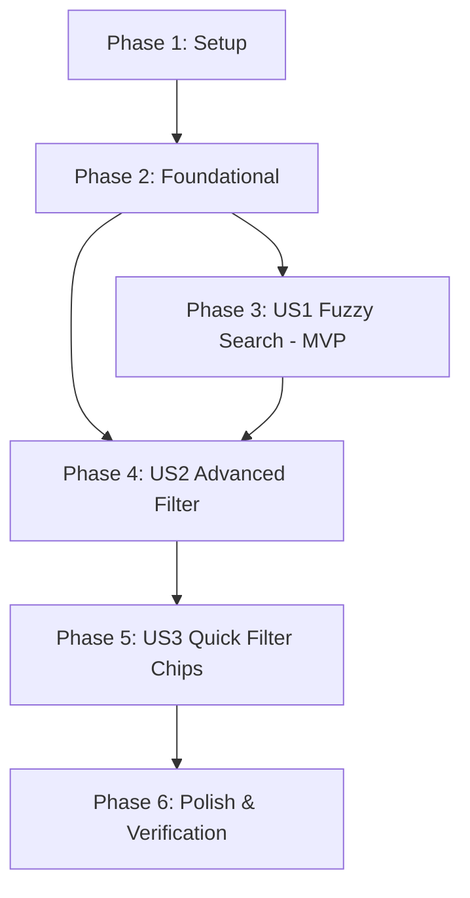

# Tasks: 014-advanced-filter-fuzzy-search

**Feature Branch**: `014-advanced-filter-fuzzy-search`
**Plan**: [plan.md](plan.md)
**Spec**: [spec.md](spec.md)

---

## Phase 1: Setup (Shared Infrastructure)

**Purpose**: Khởi tạo cấu trúc file và mô hình dữ liệu dùng chung

- [X] T001 Khởi tạo tệp mô hình tiêu chí lọc trong lib/models/transaction_filter_criteria.dart

---

## Phase 2: Foundational (Blocking Prerequisites)

**Purpose**: Xây dựng mô hình dữ liệu cốt lõi mà tất cả User Stories phụ thuộc

- [X] T002 [P] Xây dựng enum TimeFilterMode và class TransactionFilterCriteria với copyWith, isDefault, activeFilterCount trong lib/models/transaction_filter_criteria.dart
- [X] T003 [P] Xây dựng model FuzzySearchResult và ShorthandAmountResult trong lib/models/transaction_filter_criteria.dart

**Checkpoint**: Nền tảng dữ liệu đã sẵn sàng - bắt đầu triển khai các User Story độc lập

---

## Phase 3: User Story 1 - Tìm Kiếm Mờ Thông Minh & Chuẩn Hóa Tiếng Việt (Priority: P1) 🎯 MVP

**Goal**: Cho phép người dùng tìm kiếm giao dịch tức thì bằng tiếng Việt không dấu, nhận diện từ khóa viết tắt số tiền ("50k", "1.5tr") và cho phép dung sai gõ sai chính tả nhẹ trên các trường Ghi chú, Danh mục, Tên ví, Số tiền; kết quả vẫn gom nhóm theo thẻ ngày giảm dần.

**Independent Test**: Mở thanh tìm kiếm, gõ "bun bo", "an uong" hoặc "50k", hệ thống trả về đúng các giao dịch thỏa mãn trong thời gian < 100ms mà không bị mất cấu trúc Day Cards.

### Tests for User Story 1 ⚠️

- [X] T004 [P] [US1] Viết unit test cho hàm normalizeVietnamese và tryParseShorthandAmount trong test/unit/fuzzy_search_service_test.dart
- [X] T005 [P] [US1] Viết unit test cho thuật toán tìm kiếm mờ đa trường trong test/unit/fuzzy_search_service_test.dart

### Implementation for User Story 1

- [X] T006 [US1] Triển khai thuật toán normalizeVietnamese và tryParseShorthandAmount trong lib/services/fuzzy_search_service.dart
- [X] T007 [US1] Triển khai hàm search tìm kiếm mờ đa trường (note, category, wallet, amount) trong lib/services/fuzzy_search_service.dart
- [X] T008 [US1] Tích hợp FuzzySearchService vào thanh tìm kiếm TextField trên AppBar của TransactionScreen và duy trì cấu trúc Day Cards trong lib/screens/transaction_screen.dart

**Checkpoint**: User Story 1 hoàn thành - có thể test và nghiệm thu tính năng tìm kiếm mờ độc lập

---

## Phase 4: User Story 2 - Nâng Cấp Modal Bộ Lọc Nâng Cao (Priority: P2)

**Goal**: Cung cấp bộ lọc toàn diện hỗ trợ đa ví, đa danh mục, loại thu/chi, khoảng thời gian linh hoạt (mốc nhanh, MonthYearPickerModal chuẩn của app, date range) và khoảng tiền Min-Max.

**Independent Test**: Mở bộ lọc, chọn 2 ví, tích chọn 2 danh mục, chọn mốc thời gian, bấm Áp dụng -> danh sách lọc chính xác các giao dịch thỏa mãn.

### Tests for User Story 2 ⚠️

- [X] T009 [P] [US2] Viết unit test cho pipeline lọc đa tiêu chí TransactionFilterService trong test/unit/transaction_filter_service_test.dart

### Implementation for User Story 2

- [X] T010 [US2] Triển khai TransactionFilterService thực thi pipeline lọc đa ví, đa danh mục, loại, thời gian, số tiền trong lib/services/transaction_filter_service.dart
- [X] T011 [US2] Xây dựng widget TransactionFilterBottomSheet với giao diện lưới chip hiện đại, tích hợp MonthYearPickerModal chuẩn và nút Đặt lại trong lib/widgets/transaction_filter_bottom_sheet.dart
- [X] T012 [US2] Kết nối nút Bộ lọc trên AppBar với TransactionFilterBottomSheet và truyền data đã lọc vào FuzzySearchService trong lib/screens/transaction_screen.dart

**Checkpoint**: User Story 2 hoàn thành - Bộ lọc nâng cao hoạt động hoàn chỉnh và phối hợp nhịp nhàng với thanh tìm kiếm

---

## Phase 5: User Story 3 - Thanh Quick Filter Chips (Priority: P3)

**Goal**: Bổ sung thanh chip cuộn ngang trực quan dưới AppBar cho phép chuyển nhanh ví, thời gian, loại giao dịch 1 chạm.

**Independent Test**: Bấm vào chip [Tất cả ví ▾], chọn ví "Tiền mặt" -> danh sách lập tức lọc riêng ví Tiền mặt mà không cần mở modal lớn.

### Implementation for User Story 3

- [X] T013 [P] [US3] Xây dựng widget QuickFilterChipsBar cuộn ngang hỗ trợ chọn nhanh Ví, Thời gian, Loại và chip mở modal có badge đếm trong lib/widgets/quick_filter_chips_bar.dart
- [X] T014 [US3] Nhúng QuickFilterChipsBar vào giao diện danh sách ngay dưới AppBar trong lib/screens/transaction_screen.dart

**Checkpoint**: Toàn bộ 3 User Stories đã hoàn thành và tích hợp liền mạch

---

## Phase 6: Polish & Cross-Cutting Concerns

**Purpose**: Đảm bảo chất lượng toàn diện, kiểm thử hồi quy và hiệu năng

- [X] T015 [P] Chạy toàn bộ test suite unit & widget test qua flutter test
- [X] T016 Kiểm tra phân tích mã nguồn qua flutter analyze lib/
- [X] T017 Xác thực các kịch bản quickstart.md và biên dịch kiểm tra flutter build apk --debug

---

## Dependencies & Execution Order

### Phase Dependencies

### User Story Dependencies

- **User Story 1 (P1 - MVP)**: Có thể triển khai và kiểm thử độc lập ngay sau Phase 2.
- **User Story 2 (P2)**: Triển khai pipeline lọc và kết nối với Search Service từ US1 (tìm kiếm trên data đã lọc).
- **User Story 3 (P3)**: Tận dụng các tiêu chí từ US2 để hiển thị và kích hoạt nhanh qua thanh chip.

---

## Implementation Strategy

### MVP First (User Story 1 Only)
1. Hoàn thành Setup (T001) và Foundational (T002, T003).
2. Viết test và triển khai FuzzySearchService (T004 - T008).
3. Xác thực độc lập tính năng tìm kiếm tiếng Việt không dấu, "50k", "1.5tr" trên danh sách giao dịch.

### Incremental Delivery
1. Đã có MVP Search -> Thêm US2 (Advanced Filter Sheet & Service).
2. Thêm US3 (Quick Filter Chips).
3. Polish, chạy test hồi quy và build APK hoàn chỉnh.
