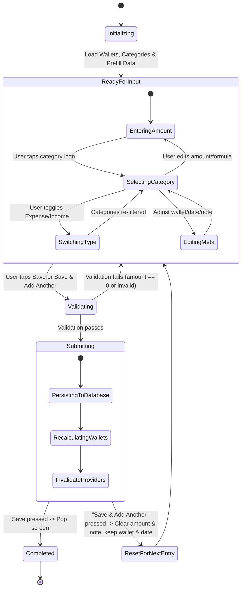

# Data Model & State Specification: Streamline Transaction Form

## 1. Domain Entities

### Transaction
Primary entity stored in SQLite `transactions` table.
```yaml
fields:
  id: String (UUID v4, primary key)
  amount: Double (strictly > 0, represents the final computed amount in base currency)
  formula: String? (optional mathematical formula if evaluated via calculator, e.g. "50000 + 25000")
  type: String ('expense' | 'income')
  category_id: String? (foreign key to categories.id)
  wallet_id: String? (foreign key to wallets.id)
  note: String? (optional text note)
  transaction_date: String (ISO 8601, e.g. "2026-09-05T12:30:00.000")
  created_at: String (ISO 8601 audit timestamp)
  updated_at: String (ISO 8601 audit timestamp)
```

### Category
Reference entity stored in SQLite `categories` table.
```yaml
fields:
  id: String (UUID or system prefix, primary key)
  name: String (display name, translated via localization)
  type: String ('expense' | 'income')
  icon: String (Material icon identifier)
  color: String (HEX color string, e.g. "#FF5722")
```

### Wallet
Account entity stored in SQLite `wallets` table.
```yaml
fields:
  id: String (UUID, primary key)
  name: String (e.g. "Tiền mặt", "Vietcombank", "MoMo")
  type: String ('cash' | 'bank' | 'ewallet' | 'credit' | 'savings' | 'other')
  initial_balance: Double
  current_balance: Double
  color: String (HEX color string)
  icon: String
  is_default: Boolean
```

---

## 2. Form UI State Model

During transaction creation or editing, the UI state is encapsulated as follows:

```yaml
TransactionFormState:
  mode: FormMode (create | edit)
  transactionId: String? (populated in edit mode)
  type: TransactionType (expense | income)
  amountText: String (raw text in amount field, can include formula like "50000 + 15000")
  evaluatedAmount: Double (live computed numeric value, 0.0 if invalid/empty)
  hasFormula: Boolean (true if expression contains operators +, -, *, /)
  categoryId: String? (selected category ID)
  walletId: String (selected wallet ID, defaults to defaultWallet.id)
  transactionDate: DateTime (selected transaction date and time)
  originalDate: DateTime? (original date when editing, used for rollback chip)
  note: String (user-typed notes)
  isValid: Boolean (evaluatedAmount > 0 && categoryId != null && walletId.isNotEmpty)
  isSubmitting: Boolean (prevents double submissions)
```

---

## 3. Validation Rules

1. **Amount Validity**:
   - `evaluatedAmount` must be strictly greater than 0 (`evaluatedAmount > 0`).
   - If `hasFormula` is true, the mathematical expression must be fully evaluable. Incomplete expressions (e.g., ending with trailing `+` or `/ 0`) must either fallback to the left operand or disable the submit action.
2. **Category Selection**:
   - In Expense mode, `categoryId` must match a category with `type == 'expense'`.
   - In Income mode, `categoryId` must match a category with `type == 'income'`.
   - When the user switches type, if the currently selected category does not match the new type, it must be cleared to prevent cross-type mismatch.
3. **Wallet Selection**:
   - `walletId` must reference an active wallet. If unselected, defaults to the designated default wallet.
4. **Date Constraints**:
   - `transactionDate` cannot be null. In Add mode, defaults to `DateTime.now()`. In Edit mode, defaults to the transaction's existing date.

---

## 4. State Lifecycle & Transitions


