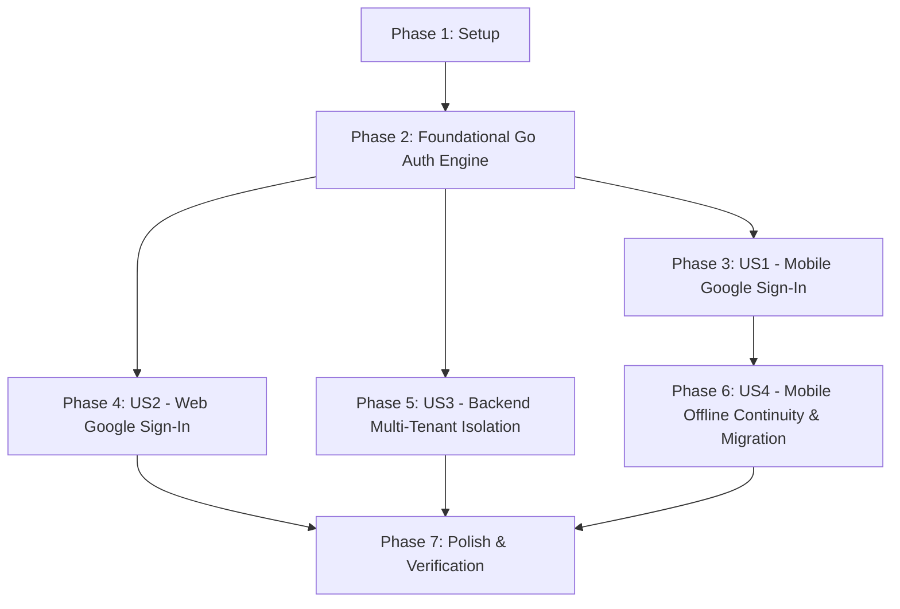

# Tasks: Google Authentication & Cross-Platform Session Management

**Feature**: `017-google-authentication` | **Date**: 2026-09-13 | **Spec**: [`spec.md`](spec.md) | **Plan**: [`plan.md`](plan.md)

---

## Phase 1: Setup (Shared Infrastructure)

**Purpose**: Dependency installation and environment configuration across Server, Web, and Mobile.

- [X] T001 Update environment configuration and dependencies in `apps/server/go.mod` and `apps/server/.env.example`
- [X] T002 [P] Install `@react-oauth/google` dependency and update configuration in `apps/web/package.json`
- [X] T003 [P] Add `google_sign_in` dependency in `apps/mobile/pubspec.yaml`

---

## Phase 2: Foundational (Blocking Prerequisites)

**Purpose**: Core Go backend authentication engine, user repository, and token management that MUST be complete before client features can authenticate.

**⚠️ CRITICAL**: All user story integrations depend on this foundation.

- [X] T004 [P] Define authentication request/response models and user entity DTOs in `apps/server/internal/model/auth.go`
- [X] T005 [P] Implement user repository interface and PostgreSQL queries (UpsertUserByGoogleID, GetUserByID) in `apps/server/internal/repository/user_repo.go`
- [X] T006 [P] Update config to include `GOOGLE_CLIENT_ID` and `DEV_AUTH_BYPASS` in `apps/server/internal/config/config.go`
- [X] T007 Implement JWT session generation, token parsing, and Google ID token validation logic in `apps/server/internal/service/auth_service.go`
- [X] T008 Implement auth HTTP handlers (`POST /api/v1/auth/google`, `GET /api/v1/auth/me`) in `apps/server/internal/handler/auth_handler.go`
- [X] T009 Register auth routes in `apps/server/internal/router/router.go`
- [X] T010 Unit tests for JWT generation and Google ID token validation in `apps/server/internal/service/auth_service_test.go`
- [X] T011 [P] Unit tests for auth handlers in `apps/server/internal/handler/auth_handler_test.go`

**Checkpoint**: Backend Auth endpoints (`/api/v1/auth/google` and `/api/v1/auth/me`) are operational and covered by unit tests.

---

## Phase 3: User Story 1 - One-Tap Google Sign-In on Mobile (Priority: P1) 🎯 MVP

**Goal**: Authenticate mobile users via Google Sign-In, exchange ID token with backend for Simo JWT session, store session securely, and display user profile in Settings.

**Independent Test**:
1. Launch mobile app and navigate to Settings.
2. Tap "Đăng nhập với Google" and complete Google account picker.
3. Verify user name and avatar appear in profile card and session persists on restart.

### Implementation for User Story 1

- [X] T012 [P] [US1] Create user profile data model in `apps/mobile/lib/models/user_profile.dart`
- [X] T013 [P] [US1] Implement mobile authentication service with Google Sign-In SDK and backend token exchange in `apps/mobile/lib/services/auth_service.dart`
- [X] T014 [US1] Implement Riverpod auth state notifier and provider for session lifecycle in `apps/mobile/lib/providers/auth_provider.dart`
- [X] T015 [US1] Update Settings screen with Google Account profile card and Sign-In/Sign-Out actions in `apps/mobile/lib/screens/settings_screen.dart`
- [X] T016 [US1] Update SyncService to inject Bearer JWT session token into cloud sync requests in `apps/mobile/lib/services/sync_service.dart`
- [X] T017 [US1] Unit and widget tests for mobile auth provider and service in `apps/mobile/test/auth_service_test.dart`

**Checkpoint**: Mobile app can sign in with Google, retain session across app restarts, and attach JWT token to sync calls.

---

## Phase 4: User Story 2 - Google Sign-In on Web Dashboard (Priority: P1)

**Goal**: Enable Google Sign-In for desktop web users, persist JWT session in `localStorage`, and display user profile in Navbar with Sign-Out capability.

**Independent Test**:
1. Open web app at `http://localhost:3000`.
2. Complete Google login flow via popup.
3. Verify redirect to dashboard, user avatar in Navbar, and session persistence across page refreshes.

### Implementation for User Story 2

- [X] T018 [P] [US2] Create React AuthContext with Google login handler, user state, and localStorage token persistence in `apps/web/src/contexts/AuthContext.tsx`
- [X] T019 [P] [US2] Update API client service with auth endpoints (`/auth/google`, `/auth/me`) and Bearer token header interceptor in `apps/web/src/services/api.ts`
- [X] T020 [US2] Create responsive Dark-themed Login page with Google Identity Services button in `apps/web/src/pages/Login.tsx`
- [X] T021 [US2] Update Navbar component with user profile avatar, email display, and Sign-Out dropdown action in `apps/web/src/components/Navbar.tsx`
- [X] T022 [US2] Wrap App router with AuthProvider and protect Dashboard routes against unauthenticated access in `apps/web/src/App.tsx`

**Checkpoint**: Web app enforces authentication, supports Google login popup, and seamlessly manages user sessions.

---

## Phase 5: User Story 3 - Strict Multi-Tenant Data Isolation on Backend (Priority: P1)

**Goal**: Guarantee 100% data privacy and isolation so every database query is strictly scoped to the authenticated user UUID from JWT claims.

**Independent Test**:
1. Authenticate User A and create a wallet and transaction.
2. Authenticate User B on separate session and query all resources.
3. Verify User B sees empty data (0 wallets, 0 transactions).

### Implementation for User Story 3

- [X] T023 [US3] Update auth middleware to enforce JWT validation and inject user UUID into request context for protected routes in `apps/server/internal/middleware/auth.go`
- [X] T024 [US3] Ensure sync repository and service scope all sync push/pull operations by authenticated `user_id` in `apps/server/internal/service/sync_service.go`
- [X] T025 [US3] Ensure dashboard repository and handlers filter all metrics by authenticated `user_id` in `apps/server/internal/repository/dashboard_repo.go`
- [X] T026 [US3] Integration test verifying multi-tenant data isolation and unauthorized request rejection in `apps/server/internal/service/multi_tenant_test.go`

**Checkpoint**: Multi-tenant isolation verified with zero cross-user data leakage and 100% 401 rejection on unauthenticated calls.

---

## Phase 6: User Story 4 - Seamless Offline Continuity for Authenticated Users (Priority: P2)

**Goal**: Allow mobile users to launch app and record transactions 100% offline, automatically linking guest-created records to the authenticated user UUID on initial login.

**Independent Test**:
1. Create local transactions in offline guest mode.
2. Sign in with Google; verify local data is re-tagged to user UUID and synced to cloud without loss.
3. Turn on Airplane mode, restart app; verify instant launch with full offline functionality.

### Implementation for User Story 4

- [X] T027 [US4] Implement guest data migration logic to associate pre-login local SQLite records with authenticated user UUID in `apps/mobile/lib/services/auth_service.dart`
- [X] T028 [US4] Update offline initialization flow to validate cached session credentials asynchronously without blocking UI in `apps/mobile/lib/main.dart`
- [X] T029 [US4] Unit tests for offline session restoration and guest data migration in `apps/mobile/test/offline_auth_migration_test.dart`

**Checkpoint**: Offline-first experience validated with zero startup blockage and seamless guest-to-authenticated data migration.

---

## Phase 7: Polish & Cross-Cutting Concerns

**Purpose**: Configuration templates, documentation, container build updates, and end-to-end verification.

- [X] T030 [P] Update environment configuration templates in `apps/server/.env.example` and `apps/web/.env.example`
- [X] T031 [P] Update architectural documentation with Google OAuth flows in `docs/01_architecture/offline_first_sync_architecture.md`
- [X] T032 Verify multi-platform build and run end-to-end test suite across server, web, and mobile

---

## Dependencies & Execution Order

### Phase Dependencies

- **Setup (Phase 1)**: No dependencies - can start immediately.
- **Foundational (Phase 2)**: Depends on Phase 1 completion - BLOCKS all client user stories.
- **User Story 1 (Phase 3 - Mobile)**: Depends on Phase 2 completion.
- **User Story 2 (Phase 4 - Web)**: Depends on Phase 2 completion.
- **User Story 3 (Phase 5 - Multi-Tenant Isolation)**: Depends on Phase 2 completion; can run in parallel with US1/US2.
- **User Story 4 (Phase 6 - Offline Continuity)**: Depends on Phase 3 (Mobile Auth) completion.
- **Polish (Phase 7)**: Depends on completion of all user story phases.

### User Story Dependencies

---

## Parallel Opportunities

- **Phase 1 (Setup)**: Tasks T002 (`apps/web`) and T003 (`apps/mobile`) can execute concurrently.
- **Phase 2 (Foundational)**: Tasks T004 (DTOs), T005 (Repository), and T006 (Config) can be implemented in parallel.
- **Phase 3 & Phase 4 (User Stories 1 & 2)**: Mobile and Web auth client implementations can proceed in parallel once Phase 2 is complete.
- **Unit & Contract Tests**: T010, T011, T017, T026, and T029 test suites can run independently per platform.

---

## Implementation Strategy

### MVP Scope (Phase 1 + Phase 2 + Phase 3)
1. Complete **Phase 1** (Dependencies) and **Phase 2** (Backend Auth Engine).
2. Complete **Phase 3** (Mobile Google Sign-In).
3. Validate mobile login, token exchange, and JWT session persistence on device.

### Incremental Delivery Steps
1. **Milestone 1**: Go Backend Auth API ready & tested with mock + live tokens (`/api/v1/auth/google`, `/api/v1/auth/me`).
2. **Milestone 2**: Mobile Google Sign-In integrated with settings profile view & sync header injection.
3. **Milestone 3**: Web Google Sign-In UI with GIS button & protected routes.
4. **Milestone 4**: Backend multi-tenant data isolation tests passed.
5. **Milestone 5**: Seamless offline startup & guest data migration verified.
