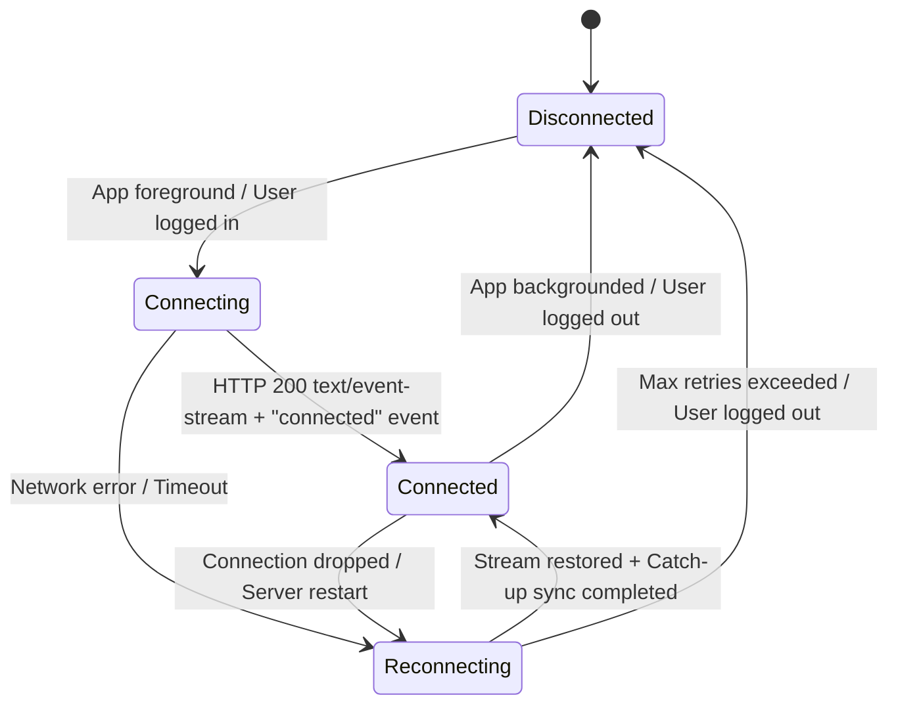

# Data Model & Streaming Schemas: Live Sync (SSE)

**Feature**: `019-sse-live-sync`
**Date**: 2026-09-13
**Status**: Approved

---

## 1. Streaming Message Schemas

### 1.1. Server-Sent Event (SSE) Protocol Format
Standard SSE payload structure emitted by Go backend over `text/event-stream`:

```text
event: <event_type>
id: <message_sequence_id>
data: <json_string>
\n\n
```

### 1.2. Event Types & Data Payloads

#### `connected` Event
Emitted immediately upon successful connection establishment.
```json
{
  "event": "connected",
  "data": {
    "user_id": "00000000-0000-0000-0000-000000000001",
    "client_id": "web-browser-tab-xyz",
    "server_time": "2026-09-13T14:15:30.123Z",
    "heartbeat_interval_sec": 20
  }
}
```

#### `data_changed` Event
Emitted when any mutation is committed to the central database by an authorized device.
```json
{
  "event": "data_changed",
  "data": {
    "source_client_id": "mobile-device-android-abc",
    "table_names": ["transactions", "wallets"],
    "server_time": "2026-09-13T14:15:35.456Z"
  }
}
```

#### `ping` (Heartbeat Keep-Alive)
Emitted every 20 seconds to prevent reverse proxy/load balancer timeout.
```text
: keepalive 2026-09-13T14:15:55Z
```
*(Or SSE comment line `: keepalive\n\n`)*

---

## 2. In-Memory Entities (Go Backend SSE Hub)

### `ClientConnection` (Internal Struct)
Represents an active client streaming connection.
| Field | Type | Description |
| :--- | :--- | :--- |
| `UserID` | `uuid.UUID` | Authenticated user account identifier |
| `ClientID` | `string` | Unique client/device identifier for echo suppression |
| `Platform` | `string` | `web` \| `mobile_android` \| `mobile_ios` \| `cli` |
| `MessageChan` | `chan *SyncEvent` | Buffered channel for outbound SSE messages (buffer size: 16) |
| `ConnectedAt` | `time.Time` | UTC timestamp of connection establishment |

### `SyncEvent` (Internal DTO)
| Field | Type | Description |
| :--- | :--- | :--- |
| `Type` | `string` | `connected` \| `data_changed` \| `ping` |
| `SourceClientID`| `string` | Originating device ID |
| `ServerTime` | `time.Time` | Server timestamp of event generation |
| `TableNames` | `[]string` | Optional list of affected tables |

---

## 3. Client State Models

### 3.1. Web Client State (`SyncStatus` & `LiveStreamStatus`)
```typescript
export type LiveStreamState = 'connecting' | 'connected' | 'disconnected' | 'reconnecting';

export interface LiveSyncState {
  streamState: LiveStreamState;
  isSyncing: boolean;
  lastSyncedTime: string | null;
  pendingCount: number;
  lastError: string | null;
}
```

### 3.2. Mobile Client State (`LiveSyncState` in Riverpod)
```dart
enum LiveStreamStatus {
  disconnected,
  connecting,
  connected,
  reconnecting,
}

class LiveSyncState {
  final LiveStreamStatus streamStatus;
  final bool isSyncing;
  final DateTime? lastSyncedTime;
  final String? errorMessage;
  
  const LiveSyncState({
    required this.streamStatus,
    required this.isSyncing,
    this.lastSyncedTime,
    this.errorMessage,
  });
}
```

---

## 4. State Transitions (Client Stream Lifecycle)


